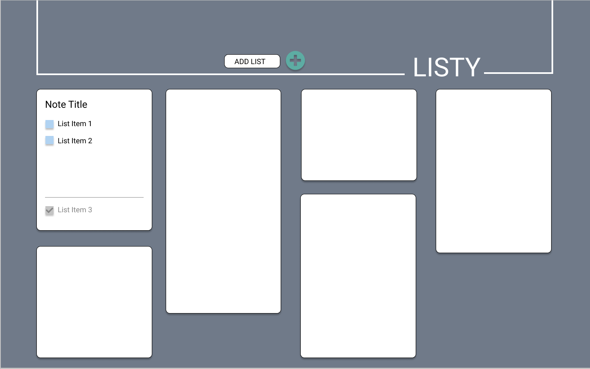
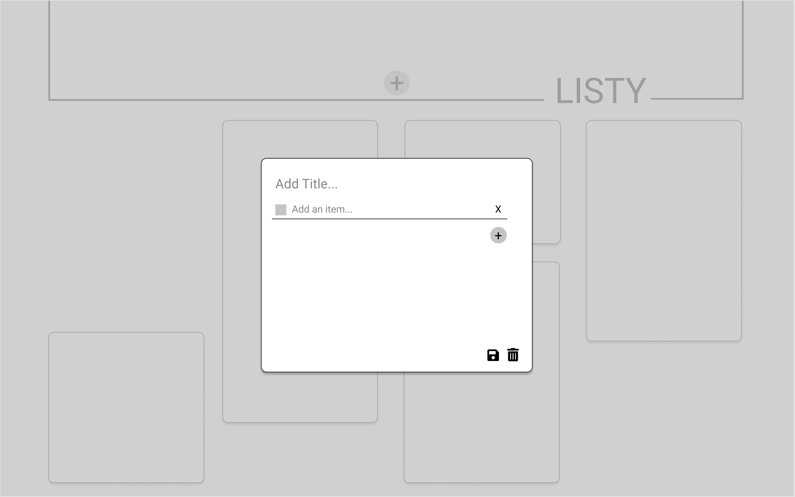
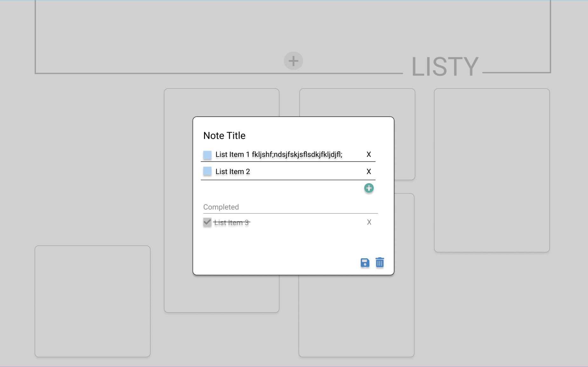

# Listy

An app created with both front-end and back-end frameworks which allows users to save, edit, and delete notes. The front-end is comprised of React, Redux, and React-Router. Whereas, the back-end is built using Node and Express.

### Set-Up Backend:
- Clone https://github.com/hillstew/listy-api.git
- Run `npm install` from the root directory
- Run `npm start` and visit localhost:3001/api/v1/notes in your browser

### Set-Up Frontend:
- Clone https://github.com/kaohman/listy.git
- Run `npm install` from the root directory  
- Run `npm start` and visit localhost:3000 in your browser  

### Primary Technologies Used:
* React
* Redux
* React Router
* JavaScript
* CSS/SCSS

### Testing:
Jest and Supertest 
Run `npm test` from the root directory  

### Final App

### Original Assignment: 
[Trapper Keeper](http://frontend.turing.io/projects/trapper-keeper.html)  

### Contributors:  
- [Heather Hartley](https://github.com/hlhartley)
- [Karin Ohman](https://github.com/kaohman)
- [Hillary Stewart](https://github.com/hillstew)

### Wireframes:
#### Homepage

#### Create Note Page

#### Edit Note Page

This project was bootstrapped with [Create React App](https://github.com/facebook/create-react-app).

