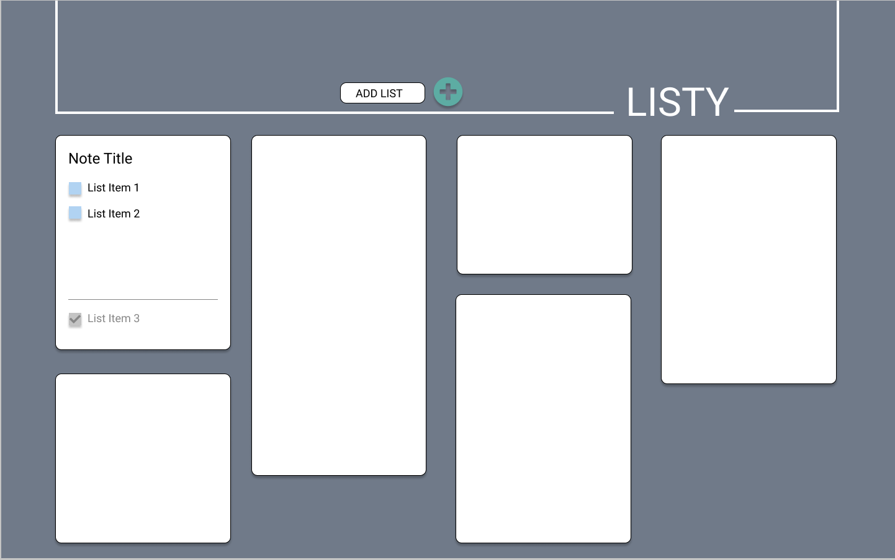
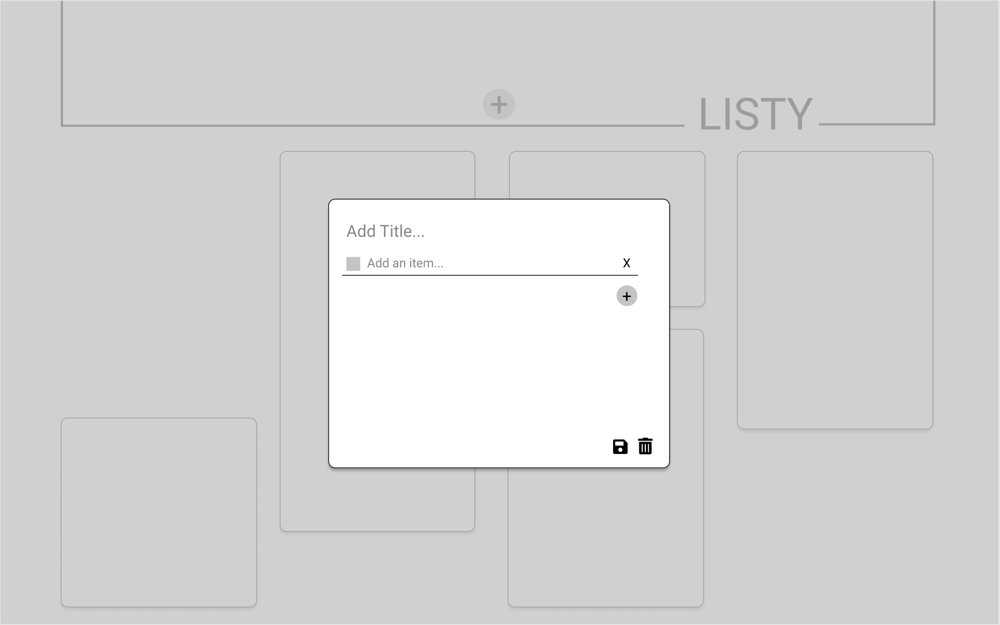
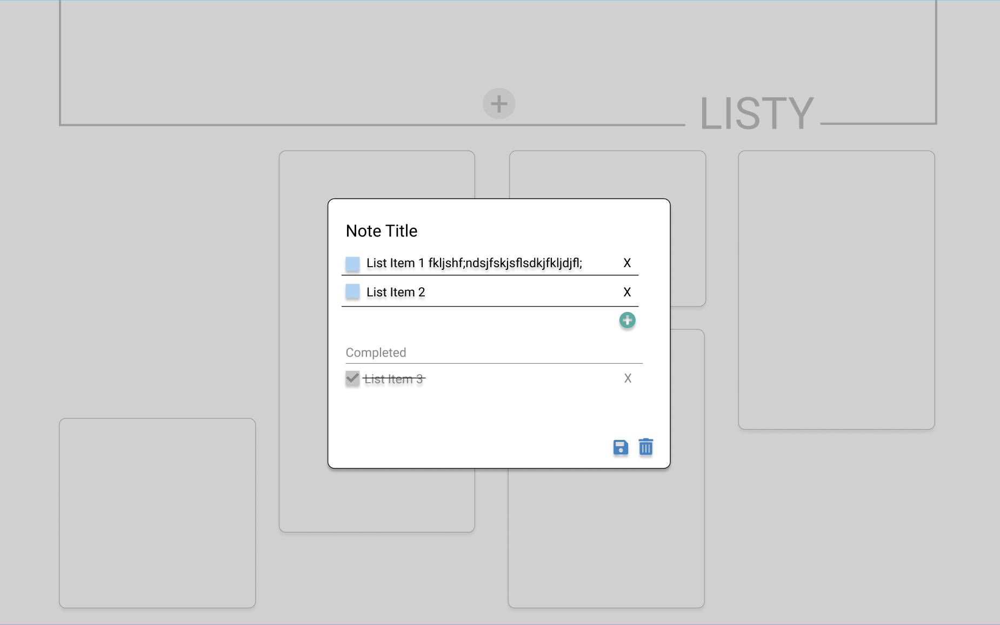

# Listy

Project description

### Set-Up Frontend:
Clone this repo  
Run `npm install` from the root directory  
Run `npm start` and visit localhost:3000 in your browser  

### Primary Technologies Used:
* React
* Redux
* React Router
* JavaScript
* CSS/SCSS

### Testing:
Jest and Enzyme for front-end testing  
Run `npm test` from the root directory  

### Original Assignment: 
[Trapper Keeper](http://frontend.turing.io/projects/trapper-keeper.html)  

### Contributors:  
- [Heather Hartley](https://github.com/hlhartley)
- [Karin Ohman](https://github.com/kaohman)
- [Hillary Stewart](https://github.com/hillstew)

### Wireframes:
#### Homepage

#### Create Note Page

#### Edit Note Page

This project was bootstrapped with [Create React App](https://github.com/facebook/create-react-app).

